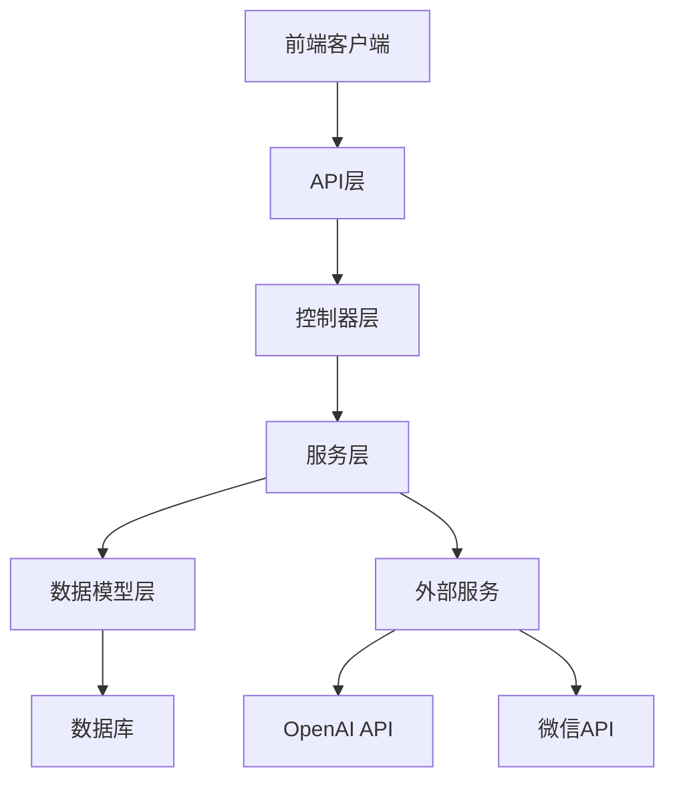
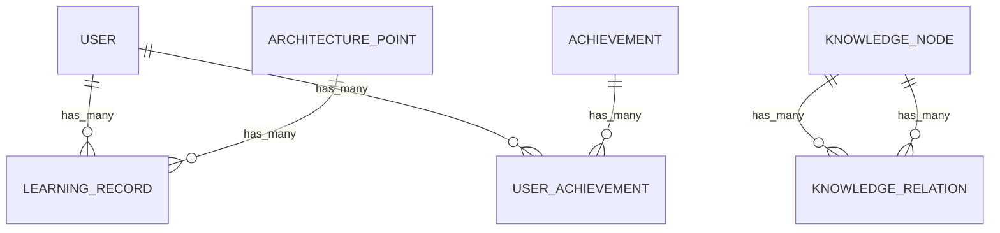
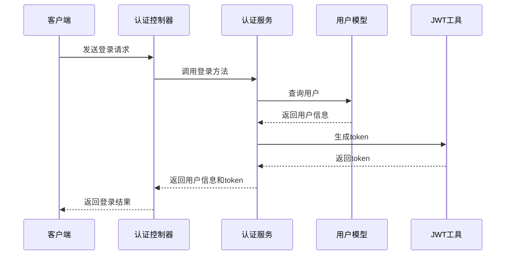
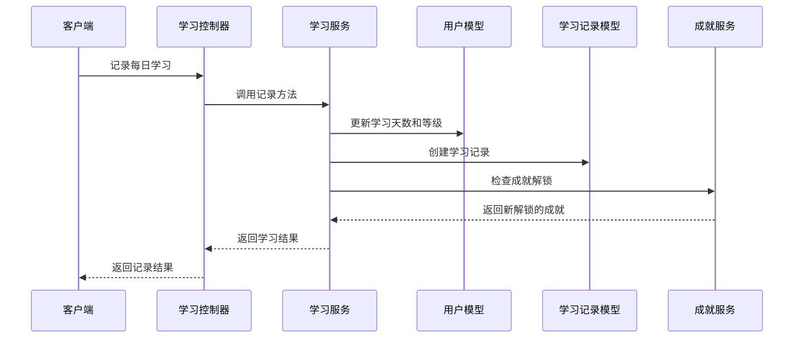
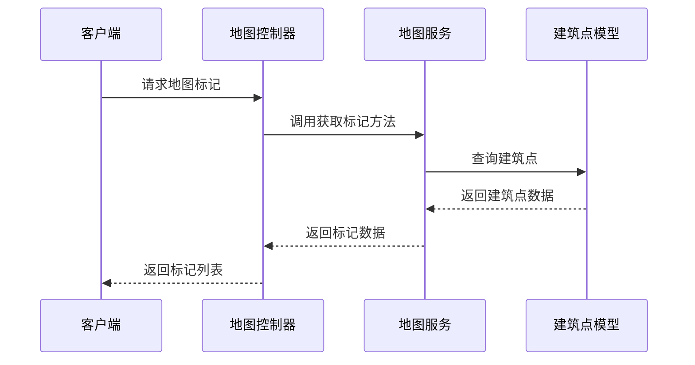

# 后端技术文档

## 1. 系统架构

### 1.1 技术栈

| 技术/框架  | 版本    | 用途       |
| ---------- | ------- | ---------- |
| Node.js    | 最新LTS | 运行环境   |
| AdonisJS   | ^7.3.0  | 后端框架   |
| TypeScript | ~6.0.2  | 开发语言   |
| Lucid ORM  | ^22.4.0 | 数据库ORM  |
| PostgreSQL | 8.20.0  | 数据库     |
| JWT        | ^9.0.3  | 认证机制   |
| OpenAI     | ^6.33.0 | AI服务集成 |
| VineJS     | ^4.3.0  | 数据验证   |

### 1.2 架构图



### 1.3 模块划分

| 模块         | 职责               | 文件位置                                                                              |
| ------------ | ------------------ | ------------------------------------------------------------------------------------- |
| 认证模块     | 处理用户登录、注册 | app/controllers/auth_controller.ts, app/services/auth_service.ts                      |
| 用户模块     | 处理用户信息管理   | app/controllers/user_controller.ts, app/services/user_service.ts                      |
| 地图模块     | 处理地图相关数据   | app/controllers/map_controller.ts, app/services/map_service.ts                        |
| 学习模块     | 处理学习路径和记录 | app/controllers/learn_controller.ts, app/services/learn_service.ts                    |
| 知识图谱模块 | 处理知识节点数据   | app/controllers/knowledge_node_controller.ts, app/services/knowledge_graph_service.ts |
| AI模块       | 处理AI交互         | app/controllers/ai_controller.ts, app/services/ai_service.ts                          |
| 首页模块     | 处理首页数据       | app/controllers/home_controller.ts, app/services/home_service.ts                      |

## 2. 数据库设计

### 2.1 数据库表结构

#### users表

| 字段名               | 数据类型    | 约束                | 描述               |
| -------------------- | ----------- | ------------------- | ------------------ |
| id                   | integer     | PRIMARY KEY         | 用户ID             |
| username             | string(255) | UNIQUE, NULL        | 用户名             |
| password_hash        | string(255) | NULL                | 密码哈希           |
| wechat_openid        | string(255) | UNIQUE, NULL        | 微信OpenID         |
| level                | integer     | NOT NULL, DEFAULT 1 | 用户等级           |
| study_days           | integer     | NOT NULL, DEFAULT 0 | 学习天数           |
| user_medals          | json        | NULL                | 用户勋章           |
| user_knowledge_radar | json        | NULL                | 用户知识雷达图数据 |
| created_at           | timestamp   | NOT NULL            | 创建时间           |
| updated_at           | timestamp   | NOT NULL            | 更新时间           |

#### achievements表

| 字段名      | 数据类型    | 约束        | 描述        |
| ----------- | ----------- | ----------- | ----------- |
| id          | integer     | PRIMARY KEY | 成就ID      |
| name        | string(255) | NOT NULL    | 成就名称    |
| description | string(255) | NULL        | 成就描述    |
| type        | string(255) | NOT NULL    | 成就类型    |
| icon_url    | string(255) | NULL        | 成就图标URL |
| created_at  | timestamp   | NOT NULL    | 创建时间    |
| updated_at  | timestamp   | NOT NULL    | 更新时间    |

#### architecture_points表

| 字段名      | 数据类型    | 约束        | 描述       |
| ----------- | ----------- | ----------- | ---------- |
| id          | integer     | PRIMARY KEY | 建筑点ID   |
| name        | string(255) | NOT NULL    | 建筑点名称 |
| description | string(255) | NULL        | 建筑点描述 |
| latitude    | double      | NOT NULL    | 纬度       |
| longitude   | double      | NOT NULL    | 经度       |
| category    | string(255) | NULL        | 类别       |
| created_at  | timestamp   | NOT NULL    | 创建时间   |
| updated_at  | timestamp   | NOT NULL    | 更新时间   |

#### learning_records表

| 字段名                | 数据类型  | 约束                  | 描述       |
| --------------------- | --------- | --------------------- | ---------- |
| id                    | integer   | PRIMARY KEY           | 学习记录ID |
| user_id               | integer   | NOT NULL, FOREIGN KEY | 用户ID     |
| architecture_point_id | integer   | NOT NULL, FOREIGN KEY | 建筑点ID   |
| is_checked_in         | boolean   | NOT NULL              | 是否签到   |
| mastery_level         | integer   | NOT NULL              | 掌握程度   |
| radar_data            | json      | NULL                  | 雷达图数据 |
| created_at            | timestamp | NOT NULL              | 创建时间   |
| updated_at            | timestamp | NOT NULL              | 更新时间   |

#### user_achievements表

| 字段名         | 数据类型  | 约束                  | 描述     |
| -------------- | --------- | --------------------- | -------- |
| id             | integer   | PRIMARY KEY           | ID       |
| user_id        | integer   | NOT NULL, FOREIGN KEY | 用户ID   |
| achievement_id | integer   | NOT NULL, FOREIGN KEY | 成就ID   |
| unlocked_at    | timestamp | NOT NULL              | 解锁时间 |
| created_at     | timestamp | NOT NULL              | 创建时间 |
| updated_at     | timestamp | NOT NULL              | 更新时间 |

#### knowledge_nodes表

| 字段名      | 数据类型    | 约束        | 描述         |
| ----------- | ----------- | ----------- | ------------ |
| id          | integer     | PRIMARY KEY | 知识节点ID   |
| title       | string(255) | NOT NULL    | 知识节点标题 |
| content     | text        | NULL        | 知识节点内容 |
| type        | string(255) | NULL        | 知识节点类型 |
| comparisons | json        | NULL        | 比较数据     |
| created_at  | timestamp   | NOT NULL    | 创建时间     |
| updated_at  | timestamp   | NOT NULL    | 更新时间     |

#### knowledge_relations表

| 字段名     | 数据类型  | 约束                  | 描述           |
| ---------- | --------- | --------------------- | -------------- |
| id         | integer   | PRIMARY KEY           | ID             |
| source_id  | integer   | NOT NULL, FOREIGN KEY | 源知识节点ID   |
| target_id  | integer   | NOT NULL, FOREIGN KEY | 目标知识节点ID |
| created_at | timestamp | NOT NULL              | 创建时间       |
| updated_at | timestamp | NOT NULL              | 更新时间       |

### 2.2 表关系



### 2.3 数据字典

| 表名                | 说明                   |
| ------------------- | ---------------------- |
| users               | 存储用户信息           |
| achievements        | 存储成就信息           |
| architecture_points | 存储建筑点信息         |
| learning_records    | 存储用户学习记录       |
| user_achievements   | 存储用户解锁的成就     |
| knowledge_nodes     | 存储知识节点信息       |
| knowledge_relations | 存储知识节点之间的关系 |

### 2.4 SQL初始化脚本

```sql
-- 创建users表
CREATE TABLE IF NOT EXISTS users (
    id SERIAL PRIMARY KEY,
    username VARCHAR(255) UNIQUE NULL,
    password_hash VARCHAR(255) NULL,
    wechat_openid VARCHAR(255) UNIQUE NULL,
    level INTEGER NOT NULL DEFAULT 1,
    study_days INTEGER NOT NULL DEFAULT 0,
    user_medals JSON NULL,
    user_knowledge_radar JSON NULL,
    created_at TIMESTAMP NOT NULL DEFAULT NOW(),
    updated_at TIMESTAMP NOT NULL DEFAULT NOW()
);

-- 创建achievements表
CREATE TABLE IF NOT EXISTS achievements (
    id SERIAL PRIMARY KEY,
    name VARCHAR(255) NOT NULL,
    description VARCHAR(255) NULL,
    type VARCHAR(255) NOT NULL,
    icon_url VARCHAR(255) NULL,
    created_at TIMESTAMP NOT NULL DEFAULT NOW(),
    updated_at TIMESTAMP NOT NULL DEFAULT NOW()
);

-- 创建architecture_points表
CREATE TABLE IF NOT EXISTS architecture_points (
    id SERIAL PRIMARY KEY,
    name VARCHAR(255) NOT NULL,
    description VARCHAR(255) NULL,
    latitude DOUBLE PRECISION NOT NULL,
    longitude DOUBLE PRECISION NOT NULL,
    category VARCHAR(255) NULL,
    created_at TIMESTAMP NOT NULL DEFAULT NOW(),
    updated_at TIMESTAMP NOT NULL DEFAULT NOW()
);

-- 创建learning_records表
CREATE TABLE IF NOT EXISTS learning_records (
    id SERIAL PRIMARY KEY,
    user_id INTEGER NOT NULL REFERENCES users(id),
    architecture_point_id INTEGER NOT NULL REFERENCES architecture_points(id),
    is_checked_in BOOLEAN NOT NULL,
    mastery_level INTEGER NOT NULL,
    radar_data JSON NULL,
    created_at TIMESTAMP NOT NULL DEFAULT NOW(),
    updated_at TIMESTAMP NOT NULL DEFAULT NOW()
);

-- 创建user_achievements表
CREATE TABLE IF NOT EXISTS user_achievements (
    id SERIAL PRIMARY KEY,
    user_id INTEGER NOT NULL REFERENCES users(id),
    achievement_id INTEGER NOT NULL REFERENCES achievements(id),
    unlocked_at TIMESTAMP NOT NULL DEFAULT NOW(),
    created_at TIMESTAMP NOT NULL DEFAULT NOW(),
    updated_at TIMESTAMP NOT NULL DEFAULT NOW()
);

-- 创建knowledge_nodes表
CREATE TABLE IF NOT EXISTS knowledge_nodes (
    id SERIAL PRIMARY KEY,
    title VARCHAR(255) NOT NULL,
    content TEXT NULL,
    type VARCHAR(255) NULL,
    comparisons JSON NULL,
    created_at TIMESTAMP NOT NULL DEFAULT NOW(),
    updated_at TIMESTAMP NOT NULL DEFAULT NOW()
);

-- 创建knowledge_relations表
CREATE TABLE IF NOT EXISTS knowledge_relations (
    id SERIAL PRIMARY KEY,
    source_id INTEGER NOT NULL REFERENCES knowledge_nodes(id),
    target_id INTEGER NOT NULL REFERENCES knowledge_nodes(id),
    created_at TIMESTAMP NOT NULL DEFAULT NOW(),
    updated_at TIMESTAMP NOT NULL DEFAULT NOW()
);
```

## 3. 接口文档

### 3.1 认证接口

#### POST /api/v1/auth/wechat-login

- **描述**：微信登录
- **请求参数**：
  - code: string (必填) - 微信登录code
  - encryptedData: string (可选) - 加密数据
  - iv: string (可选) - 加密向量
- **响应格式**：
  ```json
  {
    "code": 200,
    "message": "success",
    "data": {
      "token": "string",
      "user": {
        "id": number,
        "username": string,
        "level": number,
        "studyDays": number
      }
    }
  }
  ```
- **错误码**：
  - 400: 参数错误
  - 500: 服务器内部错误

#### POST /api/v1/auth/account-login

- **描述**：账号登录
- **请求参数**：
  - username: string (必填) - 用户名
  - password: string (必填) - 密码
- **响应格式**：
  ```json
  {
    "code": 200,
    "message": "success",
    "data": {
      "token": "string",
      "user": {
        "id": number,
        "username": string,
        "level": number,
        "studyDays": number
      }
    }
  }
  ```
- **错误码**：
  - 400: 参数错误
  - 401: 用户名或密码错误
  - 500: 服务器内部错误

#### POST /api/v1/auth/register

- **描述**：账号注册
- **请求参数**：
  - username: string (必填) - 用户名（3-20字符）
  - password: string (必填) - 密码（至少6字符）
- **响应格式**：
  ```json
  {
    "code": 200,
    "message": "success",
    "data": {
      "token": "string",
      "user": {
        "id": number,
        "username": string,
        "level": number,
        "studyDays": number
      }
    }
  }
  ```
- **错误码**：
  - 400: 参数错误
  - 409: 用户名已存在
  - 500: 服务器内部错误

### 3.2 用户接口

#### GET /api/v1/users/me

- **描述**：获取当前用户信息
- **请求头**：
  - Authorization: Bearer {token}
- **响应格式**：
  ```json
  {
    "code": 200,
    "message": "success",
    "data": {
      "id": number,
      "username": string,
      "level": number,
      "studyDays": number,
      "userMedals": object,
      "userKnowledgeRadar": object
    }
  }
  ```
- **错误码**：
  - 401: 未授权
  - 500: 服务器内部错误

#### PUT /api/v1/users/me

- **描述**：更新用户信息
- **请求头**：
  - Authorization: Bearer {token}
- **请求参数**：
  - username: string (可选) - 用户名（3-20字符）
- **响应格式**：
  ```json
  {
    "code": 200,
    "message": "success",
    "data": {
      "id": number,
      "username": string,
      "level": number,
      "studyDays": number
    }
  }
  ```
- **错误码**：
  - 400: 参数错误
  - 401: 未授权
  - 409: 用户名已存在
  - 500: 服务器内部错误

#### GET /api/v1/users/achievements

- **描述**：获取用户成就
- **请求头**：
  - Authorization: Bearer {token}
- **响应格式**：
  ```json
  {
    "code": 200,
    "message": "success",
    "data": [
      {
        "id": number,
        "name": string,
        "description": string,
        "type": string,
        "iconUrl": string,
        "unlockedAt": string
      }
    ]
  }
  ```
- **错误码**：
  - 401: 未授权
  - 500: 服务器内部错误

### 3.3 地图接口

#### GET /api/v1/maps/markers

- **描述**：获取地图标记
- **请求参数**：
  - latitude: number (必填) - 纬度
  - longitude: number (必填) - 经度
  - category: string (可选) - 类别
- **响应格式**：
  ```json
  {
    "code": 200,
    "message": "success",
    "data": [
      {
        "id": number,
        "name": string,
        "latitude": number,
        "longitude": number,
        "category": string
      }
    ]
  }
  ```
- **错误码**：
  - 400: 参数错误
  - 500: 服务器内部错误

#### GET /api/v1/maps/places

- **描述**：获取附近地点
- **请求参数**：
  - latitude: number (必填) - 纬度
  - longitude: number (必填) - 经度
  - category: string (可选) - 类别
- **响应格式**：
  ```json
  {
    "code": 200,
    "message": "success",
    "data": [
      {
        "id": number,
        "name": string,
        "latitude": number,
        "longitude": number,
        "category": string,
        "distance": number
      }
    ]
  }
  ```
- **错误码**：
  - 400: 参数错误
  - 500: 服务器内部错误

### 3.4 学习接口

#### GET /api/v1/learn/paths

- **描述**：获取学习路径
- **请求头**：
  - Authorization: Bearer {token}
- **响应格式**：
  ```json
  {
    "code": 200,
    "message": "success",
    "data": [
      {
        "id": number,
        "title": string,
        "description": string,
        "points": [
          {
            "id": number,
            "name": string,
            "latitude": number,
            "longitude": number
          }
        ]
      }
    ]
  }
  ```
- **错误码**：
  - 401: 未授权
  - 500: 服务器内部错误

#### POST /api/v1/learn/record

- **描述**：记录每日学习
- **请求头**：
  - Authorization: Bearer {token}
- **响应格式**：
  ```json
  {
    "code": 200,
    "message": "success",
    "data": {
      "studyDays": number,
      "level": number,
      "newAchievements": [
        {
          "id": number,
          "name": string,
          "description": string,
          "type": string
        }
      ]
    }
  }
  ```
- **错误码**：
  - 401: 未授权
  - 500: 服务器内部错误

### 3.5 首页接口

#### GET /api/v1/home/data

- **描述**：获取首页数据
- **响应格式**：
  ```json
  {
    "code": 200,
    "message": "success",
    "data": {
      "featuredPoints": [
        {
          "id": number,
          "name": string,
          "description": string,
          "latitude": number,
          "longitude": number
        }
      ],
      "statistics": {
        "totalUsers": number,
        "totalPoints": number,
        "totalRecords": number
      }
    }
  }
  ```
- **错误码**：
  - 500: 服务器内部错误

### 3.6 知识图谱接口

#### GET /api/v1/knowledge-nodes/:id

- **描述**：获取知识节点详情
- **路径参数**：
  - id: number - 知识节点ID
- **响应格式**：
  ```json
  {
    "code": 200,
    "message": "success",
    "data": {
      "id": number,
      "title": string,
      "content": string,
      "type": string,
      "comparisons": object,
      "relatedNodes": [
        {
          "id": number,
          "title": string,
          "type": string
        }
      ]
    }
  }
  ```
- **错误码**：
  - 404: 知识节点不存在
  - 500: 服务器内部错误

### 3.7 AI接口

#### POST /api/v1/ai/chats

- **描述**：AI聊天
- **请求头**：
  - Authorization: Bearer {token}
- **请求参数**：
  - message: string (必填) - 聊天消息
  - context: object (可选) - 上下文信息
- **响应格式**：
  ```json
  {
    "code": 200,
    "message": "success",
    "data": {
      "response": string,
      "context": object
    }
  }
  ```
- **错误码**：
  - 400: 参数错误
  - 401: 未授权
  - 500: 服务器内部错误

## 4. 业务逻辑

### 4.1 认证流程



### 4.2 学习记录流程



### 4.3 地图数据获取流程



## 5. 部署说明

### 5.1 环境依赖

| 依赖       | 版本/要求 |
| ---------- | --------- |
| Node.js    | >= 18.0.0 |
| PostgreSQL | >= 12.0   |
| pnpm       | >= 7.0.0  |

### 5.2 部署流程

1. **克隆代码**：

   ```bash
   git clone <repository-url>
   cd cp-backend
   ```

2. **安装依赖**：

   ```bash
   pnpm install
   ```

3. **配置环境变量**：
   - 复制 `.env.example` 文件为 `.env`
   - 修改 `.env` 文件中的配置项

4. **数据库迁移**：

   ```bash
   node ace migration:run
   ```

5. **构建项目**：

   ```bash
   pnpm build
   ```

6. **启动服务**：
   ```bash
   pnpm start
   ```

### 5.3 配置说明

| 配置项         | 说明           | 默认值     |
| -------------- | -------------- | ---------- |
| DB_HOST        | 数据库主机     | localhost  |
| DB_PORT        | 数据库端口     | 5432       |
| DB_USER        | 数据库用户名   | postgres   |
| DB_PASSWORD    | 数据库密码     | postgres   |
| DB_DATABASE    | 数据库名称     | cp_backend |
| APP_KEY        | 应用密钥       | 随机生成   |
| JWT_SECRET     | JWT密钥        | 随机生成   |
| OPENAI_API_KEY | OpenAI API密钥 | -          |
| WECHAT_APPID   | 微信AppID      | -          |
| WECHAT_SECRET  | 微信AppSecret  | -          |

### 5.4 启动命令

| 命令           | 说明         |
| -------------- | ------------ |
| pnpm dev       | 开发模式启动 |
| pnpm start     | 生产模式启动 |
| pnpm build     | 构建项目     |
| pnpm test      | 运行测试     |
| pnpm lint      | 代码检查     |
| pnpm format    | 代码格式化   |
| pnpm typecheck | 类型检查     |

## 6. 安全策略

### 6.1 认证授权机制

- **JWT认证**：使用JSON Web Token进行身份验证
- **密码加密**：使用bcrypt对密码进行哈希处理
- **权限控制**：通过中间件实现API访问权限控制
- **令牌有效期**：设置合理的令牌有效期

### 6.2 数据加密方案

- **敏感数据加密**：对敏感数据进行加密存储
- **传输加密**：使用HTTPS协议进行数据传输
- **环境变量**：使用环境变量存储敏感配置

### 6.3 接口安全措施

- **输入验证**：使用VineJS进行请求参数验证
- **CSRF防护**：启用CSRF保护
- **请求限流**：实现API请求限流
- **日志记录**：记录关键操作日志

### 6.4 防攻击策略

- **SQL注入防护**：使用ORM和参数化查询
- **XSS防护**：对输入输出进行过滤
- **CORS配置**：合理配置CORS策略
- **错误处理**：统一错误处理，避免泄露敏感信息

## 7. 总结

本后端系统采用AdonisJS框架构建，遵循MVC架构模式，实现了用户认证、学习记录、地图数据、知识图谱和AI交互等核心功能。系统使用PostgreSQL数据库存储数据，通过JWT实现认证授权，保证了系统的安全性和可靠性。

系统设计合理，代码结构清晰，接口规范，便于维护和扩展。通过本技术文档，开发人员可以快速了解系统架构、数据库设计、API接口和业务逻辑，为后续的开发和维护工作提供参考。
